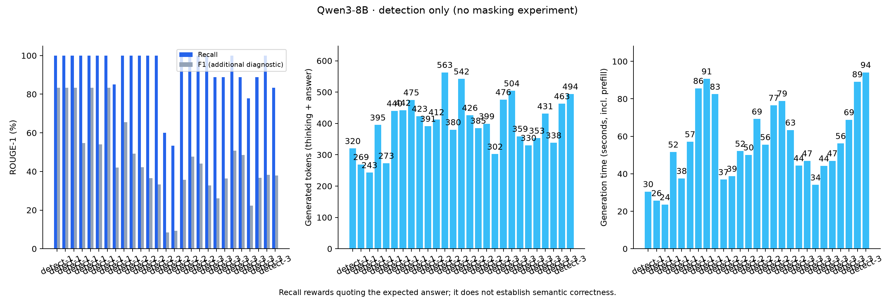
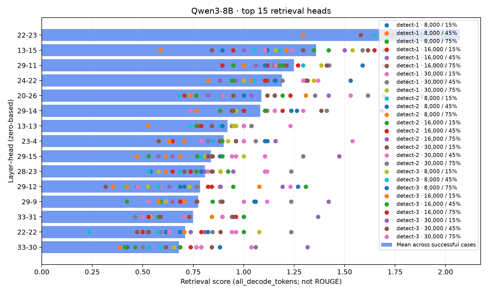
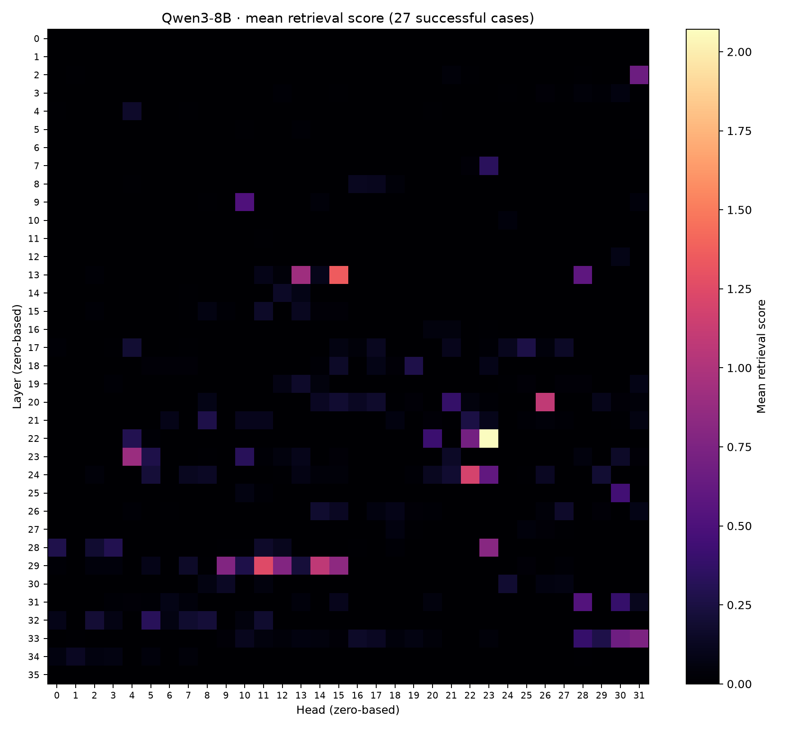
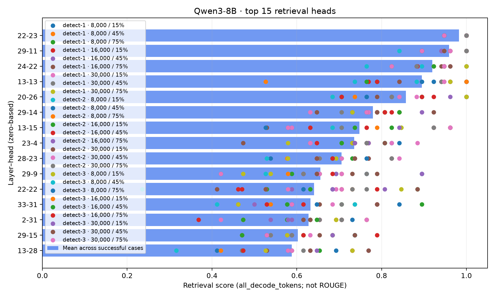
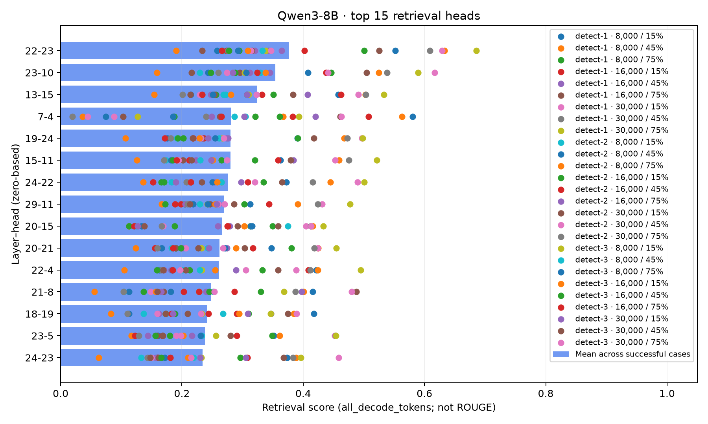
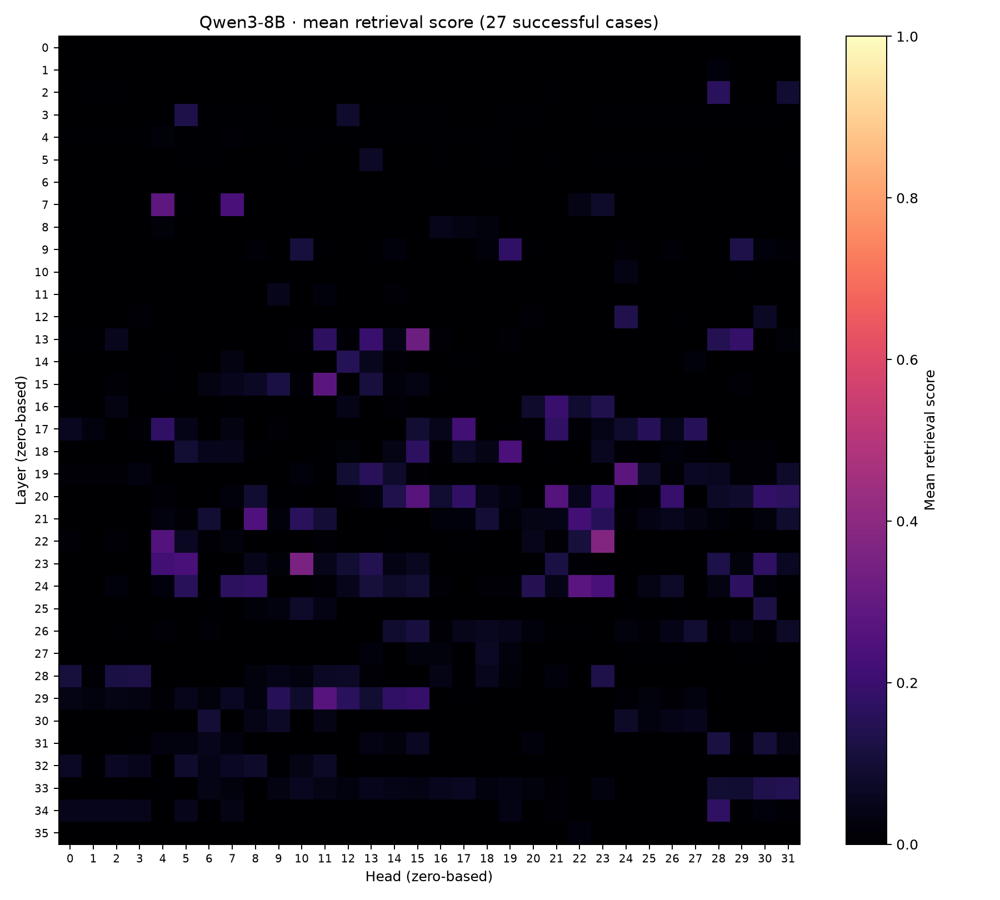
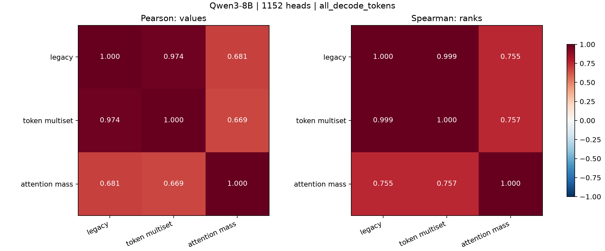
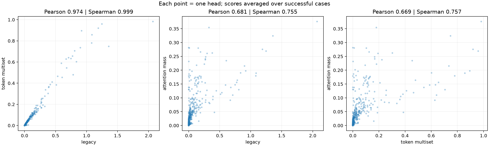
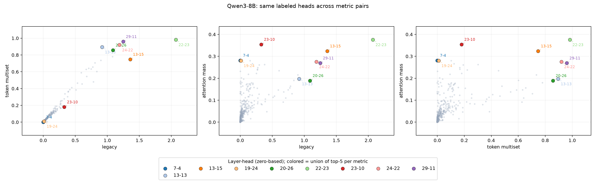

# Retrieval heads: промежуточный отчёт

Состояние на 8 октября 2026 года. Отчёт описывает реализованный код и уже
проверенные прогоны. Основной результат — detection survey Qwen3-8B без YaRN;
его masking-проверка и парный survey с YaRN пока не запускались.

## 1. Краткий итог

- Реализованы адаптеры Qwen3-4B-Thinking-2507, обычной Qwen3-8B и Qwen3-8B с YaRN.
- Attention анализируется онлайн; полные матрицы по умолчанию не накапливаются.
- Три метрики голов можно вычислять на одной генерации, с thinking или без него.
- Сбор результатов, агрегация рейтингов и masking разделены на отдельные этапы.
- Проверена работа Qwen3-4B на 48k и Qwen3-8B на 30k на V100 32 ГБ.
- Survey 8B: 27 завершённых случаев, все EOS, средний ROUGE-1 recall 93,15/100.
- Legacy и multiset почти одинаково ранжируют головы; attention-mass даёт
  отличающийся рейтинг. Это наблюдение, не доказательство причинной важности.

## 2. Что изменилось в коде

### Модели и загрузка

Общие загрузка checkpoint, chat prompt и cached decode находятся в
[`qwen_common.py`](retrieval_heads/models/qwen_common.py). Загружается исходная
модель Transformers; собственный attention-backend подключается для наблюдения
и маскирования во время decode, а не заменяет архитектуру модели.

Доступны адаптеры:

| Имя | Checkpoint / назначение | Бюджет контекста |
|---|---|---|
| `qwen35` | Qwen3.5, гибридная архитектура; наблюдаются full-attention слои | Из конфигурации модели |
| `qwen3` | Dense Qwen3, по умолчанию Qwen3-4B-Thinking-2507 | Из конфигурации модели |
| `qwen3_8b` | Qwen/Qwen3-8B, без включения YaRN | 32 768 токенов |
| `qwen3_8b_yarn` | Те же веса 8B, static YaRN ×4 | 131 072 токена |

Бюджет включает **полный chat prompt + max_new_tokens**. Thinking и финальный
ответ делят общий лимит генерации. Вариант YaRN отличается настройками RoPE и
расширенным лимитом: код inference, метрики и masking общие. Настройки применяются
при загрузке; веса и `config.json` на диске не изменяются.

[`model_source.py`](retrieval_heads/model_source.py) поддерживает явный локальный
checkpoint и заданные корни поиска. Готовый локальный checkpoint проверяется и
загружается с `local_files_only=True`. В облачных Qwen3-конфигах используется
проектный диск и offline-режим: повторного скачивания весов между джобами нет.

### Prefill, память и наблюдение

Prompt обрабатывается через выбранный prefill-backend, затем модель генерирует
по одному токену с KV-кэшем. Генерация сейчас greedy; sampling-параметры в этих
экспериментах не используются.

В [`prefill.py`](retrieval_heads/attention/prefill.py) добавлен
`sdpa_memory_efficient`: K/V временно повторяются до числа query-голов, GQA-флаг
не используется, разрешён только efficient SDPA backend. Тихий fallback на
квадратично затратный math-backend запрещён. Кэш остаётся компактным GQA-кэшем.
Обычный `sdpa` и `flash_attention_2` остаются выбираемыми; установленный и
проверенный путь в описанных длинных прогонах — `sdpa_memory_efficient`.

Controller на каждом анализируемом шаге передаёт компактные значения:
top1-позицию для старых метрик и/или сумму attention по needle-span для новой.
Данные шага освобождаются после обновления коллектора. `--capture full` — отдельный
дорогой режим сохранения полных decode-распределений, в описанных прогонах выключен.

### Thinking и оценка ответа

`--attention-scope answer_only` анализирует только шаги после `</think>`;
`all_decode_tokens` включает thinking. Qwen3 по умолчанию использует answer_only,
но survey явно выбирает all_decode_tokens. ROUGE независимо от scope считается
по финальному ответу; незавершённое thinking не считается финальным ответом.
EOS завершает Qwen3; переводы строки не останавливают её thinking.

### Три метрики голов

Реализации разделены на классы в [`scoring.py`](retrieval_heads/experiment/scoring.py).
Здесь «needle-span» — диапазон в промпте, найденный исходным overlap-locator по
**ожидаемому ответу** (`real_needle`), не обязательно вся вставленная фраза.
Совпадения определяются по token ID токенизатора, а не по целым словам.

| Метрика | Правило | Диапазон |
|---|---|---|
| `legacy` | Top1 внимания попал в span, и token ID источника совпал с генерируемым: +1 / длина span. Повторы не ограничены | Может быть >1 |
| `needle_token_multiset_v1` | То же попадание, но число зачётов каждого token ID ограничено его частотой в span отдельно для каждой головы | 0–1 |
| `needle_attention_mass_v1` | На шагах, где generated token ID встречается в span, суммируется внимание головы по всему span; затем среднее по таким шагам | 0–1 |

Attention-mass учитывает повторные квалифицирующие шаги и нулевую массу;
если таких шагов нет, score равен нулю. Это не вероятность правильности ответа.
Все три метрики считаются на одной генерации, поэтому сравнение не смешивает
разные выводы модели. Отсортированные общие рейтинги используют средние
per-case scores; у attention-mass это среднее средних по случаям, а не единое
среднее всех токенов всех случаев.

### Разделение этапов и сохранение результатов

1. [`retrieval_head_detection.py`](retrieval_head_detection.py) сохраняет каждый
   завершённый случай без отсева: контекст, ответ, thinking, выходные token IDs,
   ROUGE, время, причину остановки и итоговые scores всех голов по всем метрикам.
2. [`aggregate_head_scores.py`](aggregate_head_scores.py) работает на CPU:
   читает эти результаты, отбирает случаи и создаёт общий рейтинг.
3. [`needle_in_haystack_with_mask.py`](needle_in_haystack_with_mask.py) читает
   выбранный рейтинг и проверяет влияние маскирования.

По умолчанию агрегация включает только случаи с ROUGE **строго >50**. Можно
использовать `--all-cases`, другой порог, фильтры корпусов/длин/позиций и отдельную
папку вывода. Исходные per-case результаты при этом не меняются.
Именованные рейтинги и manifest агрегации лежат в `detection/aggregation/`.
Общего alias `head_scores.json` новые прогоны не создают. `run_id` позволяет
отличить результаты текущего запуска от файлов, оставшихся в той же папке.

**Детализация по умолчанию:** одна генерация → метрика → голова → итоговый score.
Пошаговые scores, attention-векторы, logits, скрытые состояния и KV-кэш не
сохраняются. Полный входной список token IDs также не сохраняется, только его
SHA256 и текст контекста. Для attention-mass сохраняется число учтённых шагов.
Низкий ROUGE не мешает сохранить индивидуальные scores; технический сбой до
завершения генерации может оставить текущий случай без result JSON.

### Masking и запуск этапов

`datasphere/job.py` имеет режимы `smoke` (detection), `mask` (готовый рейтинг)
и `full` (detection → агрегация → masking). В survey-YAML detection и агрегатор
последовательно вызываются напрямую, без masking.

Алгоритмы выбора: top-k, bottom-k и random. Bottom-k берёт хвост всего рейтинга;
при равных оценках выбор фиксируется порядком рейтинга. Random по прежней схеме
исключает лидирующие головы. В обёртке выбирается набор `--mask-selections`,
размеры маски, context seeds и число random-повторов; baseline выполняется один
раз на соответствующий вход.

Выбор голов и способ воздействия — разные параметры. Прежний `legacy_uniform`
обнуляет attention-logits выбранных голов до softmax, получая равномерное
распределение, **не нулевой выход головы**. `zero_output` — отдельная абляция.
Masking применяется ко всему decode, включая thinking; prefill не маскируется.

## 3. Что уже протестировано

| Прогон | GPU / контекст | Результат |
|---|---|---|
| Qwen3-4B Thinking smoke | T4, 1k, max2048 | 3 случая, ROUGE recall100, EOS |
| Memory smoke 4B | T4, 24k | 3 случая, recall100, EOS; peak allocated12,536GiB |
| Thinking smoke 4B | T4, 24k, all_decode_tokens | Те же входы и выходные token IDs, но анализ включает thinking |
| Single smoke 4B | V100, 48k | Recall100, EOS514 токенов, 137,58сек, peak17,612GiB |
| Single smoke 8B без YaRN | V100, 30k, три метрики | Recall85, EOS475 токенов, 89,47сек, peak22,343GiB |
| Survey 8B без YaRN | V100, 8k/16k/30k | 27/27 завершённых случаев и default aggregation |

Диагностические неудачи тоже важны:

- Обычный SDPA на T4 завершился OOM на первом случае8k после трёх успешных4k:
  путь GQA перешёл на math attention. Исправление проверено memory-efficient
  smoke на24k и последующими V100-прогонами.
- Попытка48k на `gt4i.1` отклонена сервисом: конфигурация недоступна сообществу;
  реального замера T4i нет.
- Первый8B30k smoke остановлен из-за CUDA busy/unavailable на выделенной машине;
  это не OOM. Один повтор на V100 успешно завершился.

Локальная проверка на момент отчёта: **53 теста, все прошли**.
В локальных тестах проверены tiny original Qwen3 forward/cache, восстановление
backend после ошибок, attention scope, компактный capture, три формулы, выбор
ranking/bottom-k, общие full/mask циклы и отдельная агрегация. Проверка YaRN на
tiny checkpoint подтвердила одинаковые веса, разные RoPE частоты и finite
forward на позиции48k; это не проверка качества реальной8B с YaRN.

## 4. Основной результат: Qwen3-8B survey

Конфигурация: [`qwen3-8b-survey.yaml`](datasphere/qwen3-8b-survey.yaml).
Полные локальные данные: `datasphere-results/qwen3-8b-survey/` (игнорируются Git).

- 3 исходных корпуса `part1/part2/part3`, по одному needle/вопросу на корпус.
- Длины8000/16000/30000, позиции15/45/75%, context seed42.
- 3 × 3 × 3 = **27 генераций**, не27 независимых вопросов.
- Нативная8B, V10032GB, FP16, memory-efficient prefill, max2048.
- Все3 метрики, scope all_decode_tokens; корпусные файлы не изменялись.

Джоба работала примерно12:47–13:19 МСК, около32минут с подготовкой/выгрузкой.
Суммарное время генераций — **1530,77сек (25,51мин)**.
Все27 случаев остановились поEOS; средняя длина выхода401,04 токена,
максимальная563. Поэтому эти результаты не проверяют худший случай2048 decode.
Пик PyTorch allocated в survey достиг22,338GiB. Это не общий расход GPU:
CUDA и reserved memory учитываются мониторингом отдельно.

ROUGE-1 здесь — **recall со stemming ×100**, не F1 и не семантическая accuracy:

| Разрез | Средний recall |
|---|---:|
| Все27 случаев | 93,15 |
| detect-1: отчётWMO | 98,33 |
| detect-2: прогулка вBeijing | 90,37 |
| detect-3: Mr.Green | 90,74 |
| Контекст8k | 97,53 |
| Контекст16k | 86,67 |
| Контекст30k | 95,25 |

Минимум53,33, максимум100; все27 прошли default порог>50, поэтому в этом
survey агрегация по успешным случаям совпадает с агрегацией всех случаев.
Немонотонность по длине не доказывает улучшение на30k: выборка маленькая,
различаются позиции и ответы.



### Лидирующие головы

Обозначение `слой-голова`, индексы начинаются с0. В каждой метрике ранжируются
1152 головы по среднему score27 случаев.

| Метрика | Первые5 голов |
|---|---|
| Legacy | 22-23, 13-15, 29-11, 24-22, 20-26 |
| Multiset | 22-23, 29-11, 24-22, 13-13, 20-26 |
| Attention-mass | 22-23, 23-10, 13-15, 7-4, 19-24 |

Голова22-23 лидирует во всех трёх: средние2,070533 / 0,982456 / 0,375923
соответственно. Числа разных метрик не сравниваются напрямую по величине.



Обычная top-1 метрика здесь — legacy: максимальное внимание должно попасть
в needle-span с совпадающим token ID. Ниже её карта по всем слоям и головам;
шкала допускает score>1 из-за повторных попаданий.









### Связь между метриками

Корреляции рассчитаны между **средними scores1152 голов** по27 случаям.
Пирсон сравнивает величины, Спирмен — ранги с усреднением связанных рангов.

| Пара | Пирсон | Спирмен |
|---|---:|---:|
| Legacy / Multiset | 0,9744 | 0,9989 |
| Legacy / Attention-mass | 0,6813 | 0,7551 |
| Multiset / Attention-mass | 0,6688 | 0,7571 |

У legacy/multiset798 голов имеют нулевое среднее, у attention-mass нулевых нет.
Совпадающие нули влияют на корреляции. Высокий глобальный коэффициент не означает
одинаковый top-k или устойчивость каждой головы между корпусами.





На следующем графике выделены конкретные головы: объединение top-5 каждой
метрики, остальные головы показаны серым фоном. Всего в анализе1152 головы.
Подписи — `слой-голова`
с индексацией от0; цвет одной головы одинаков во всех трёх панелях.
Это позволяет увидеть, как одна и та же голова оценивается разными метриками.
Выделение top-5 не меняет коэффициенты корреляции по всем головам выше.



## 5. Ограничения и дальнейшая проверка

1. **Мало независимых задач:** три needle/вопроса. Длины и позиции — повторные
   условия на этих задачах, не новые независимые корпуса.
2. **Recall недостаточен:** модель может процитировать needle и одновременно
   оспорить её как постороннюю вставку; высокий ROUGE не гарантирует смысловую
   корректность. Это наблюдалось в4B smoke и встречается в оговорках ответов8B.
3. **Greedy и max2048:** выводы относятся к текущему decoding-протоколу; длинное
   thinking может исчерпать бюджет. В survey этого не произошло.
4. **Причинная важность не проверена для нового8B survey:** нужны baseline,
   top/bottom/random masking с одинаковыми входами и одинаковым числом голов.
5. **YaRN survey отсутствует:** реализация протестирована локально, но реальное
   качество и память8B с YaRN ещё не измерены.
6. **Парность сравнений:** при одинаковых данных/tokenizer/grid/context-seed
   нативный и YaRN adapters должны получить одинаковые промпты. Проверять
   `prompt_sha256` по каждому случаю; если успешные наборы различаются, рейтинги
   сравнивать на общем выбранном наборе, а не смешивать разные случаи.
7. **Новых метрик из сохранённых attention не получить:** трейсы не сохранены.
   Можно повторно менять отбор и агрегацию уже рассчитанных per-case scores.

Следующие разумные шаги: разобрать оценки отдельно по трём корпусам и проверить
пересечение top-k, затем парный survey с YaRN на той же сетке, затем уменьшенный
masking-эксперимент. Это план, не уже полученные результаты.

## 6. Как воспроизвести обработку результатов

Команды выполняются из `updated/`, после скачивания результатов джобы:

```bash
python aggregate_head_scores.py --run datasphere-results/qwen3-8b-survey
python plot_results.py --run datasphere-results/qwen3-8b-survey --metric legacy
python plot_results.py --run datasphere-results/qwen3-8b-survey --metric needle_token_multiset_v1
python plot_results.py --run datasphere-results/qwen3-8b-survey --metric needle_attention_mass_v1
python plot_metric_correlations.py --run datasphere-results/qwen3-8b-survey
```

Для альтернативного отбора задавайте отдельную папку, чтобы не перезаписать
default aggregation:

```bash
python aggregate_head_scores.py --run datasphere-results/qwen3-8b-survey \
  --all-cases --output-dir datasphere-results/qwen3-8b-survey/detection/aggregation-all
```

Иллюстрации отчёта — копии выбранных графиков в [`report-assets/`](report-assets/).
Эта папка находится вне игнорируемой `datasphere-results/`, поэтому отчёт
можно хранить с изображениями без добавления всех сырых результатов в Git.
